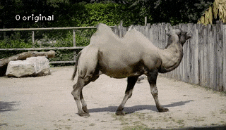
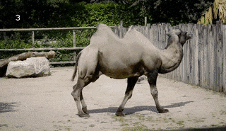
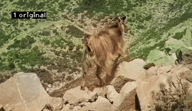
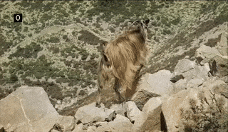

# deep-video-prior (DVP)
Code for NeurIPS 2020 paper: Blind Video Temporal Consistency via Deep Video Prior

[PyTorch implementation](https://github.com/yzxing87/pytorch-deep-video-prior) | [paper](https://arxiv.org/abs/2010.11838)
| [project website](https://chenyanglei.github.io/DVP/index.html)

## Introduction
Our method is a general framework to improve the temporal consistency of video processed by image algorithms. For example, combining image colorization or image dehazing algorithm with our framework, we can achieve the goal of video colorization or video dehazing. 


  
  


## Dependencey

### Environment
This code is based on tensorflow. It has been tested on Ubuntu 18.04 LTS.

Anaconda is recommended: [Ubuntu 18.04](https://www.digitalocean.com/community/tutorials/how-to-install-the-anaconda-python-distribution-on-ubuntu-18-04)
| [Ubuntu 16.04](https://www.digitalocean.com/community/tutorials/how-to-install-the-anaconda-python-distribution-on-ubuntu-16-04)

After installing Anaconda, you can setup the environment simply by

```
conda env create -f environment.yml
conda activate deep-video-prior
```

### Download VGG model
```
cd deep-video-prior
python download_VGG.py
unzip VGG_Model.zip
```


## Inference

### Demo 
```
bash test.sh
```
The results are placed in ./result

### Use your own data 
For the video with unimodal inconsistency:

```
python dvp_video_consistency.py --input PATH_TO_YOUR_INPUT_FOLDER --processed PATH_TO_YOUR_PROCESSED_FOLDER --task NAME_OF_YOUR_MODEL  --output ./result/OWN_DATA
```

For the video with multimodal inconsistency:

```
python dvp_video_consistency.py --input PATH_TO_YOUR_INPUT_FOLDER --processed PATH_TO_YOUR_PROCESSED_FOLDER --task NAME_OF_YOUR_MODEL --with_IRT 1 --IRT_initialization 1 --output ./result/OWN_DATA
```

Other information
```
  -h, --help            show this help message and exit
  --task TASK           Name of task
  --input INPUT         Dir of input video
  --processed PROCESSED
                        Dir of processed video
  --output OUTPUT       Dir of output video
  --use_gpu USE_GPU     Use gpu or not
  --loss {perceptual,l1,l2}
                        Chooses which loss to use. perceptual, l1, l2
  --network {unet}      Chooses which model to use. unet, fcn
  --coarse_to_fine_speedup COARSE_TO_FINE_SPEEDUP
                        Use coarse_to_fine_speedup for training
  --with_IRT WITH_IRT   Sse IRT or not, set this to 1 if you want to solve
                        multimodal inconsistency
  --IRT_initialization IRT_INITIALIZATION
                        Sse initialization for IRT
  --large_video LARGE_VIDEO
                        Set this to 1 when the number of video frames are
                        large, e.g., more than 1000 frames
  --save_freq SAVE_FREQ
                        Save frequency of epochs
  --max_epoch MAX_EPOCH
                        The max number of epochs for training
  --format FORMAT       Format of output image
```

## Citation
If you find this work useful for your research, please cite:
```
@inproceedings{lei2020dvp,
  title={Blind Video Temporal Consistency via Deep Video Prior},
  author={Lei, Chenyang and Xing, Yazhou and Chen, Qifeng},
  booktitle={Advances in Neural Information Processing Systems},
  year={2020}
}                
```

```
@article{DVP_lei,
  author    = {Chenyang Lei and
               Yazhou Xing and
               Hao Ouyang and
               Qifeng Chen},
  title     = {Deep Video Prior for Video Consistency and Propagation},
  journal = {IEEE Transactions on Pattern Analysis and Machine Intelligence},
  year      = {To Appear}
}
```


## Contact
Please contact me if there is any question (Chenyang Lei, leichenyang7@gmail.com)

## Beyond the tasks we evaluated
Researcher found that Blind Temporal Consistency (e.g., DVP) can be applied to many more tasks!
- Video segmentation [AuxAdapt: Stable and Efficient Test-Time Adaptation for Temporally Consistent Video Semantic Segmentation](https://arxiv.org/pdf/2110.12369.pdf)
- Video denoising [Neural Radiance Flow for 4D View Synthesis and Video Processing](https://arxiv.org/pdf/2012.09790.pdf)
- Low-light Video Enhancement [Learning Temporal Consistency for Low Light Video Enhancement from Single Images](https://openaccess.thecvf.com/content/CVPR2021/papers/Zhang_Learning_Temporal_Consistency_for_Low_Light_Video_Enhancement_From_Single_CVPR_2021_paper.pdf) 


